# 🐣 OnboAArrrd

An onboarding platform designed to help new employees integrate smoothly into a company, built with **Django**, **PostgreSQL**, and **Docker**.

## Screenshots

Run `docker compose up`, seed demo data (`python manage.py seed_demo`), then capture UI shots with Playwright:

```bash
pip install playwright
python -m playwright install chromium
python scripts/capture_screenshots.py
```

### Public pages

| Landing page | Login |
|:---:|:---:|
| 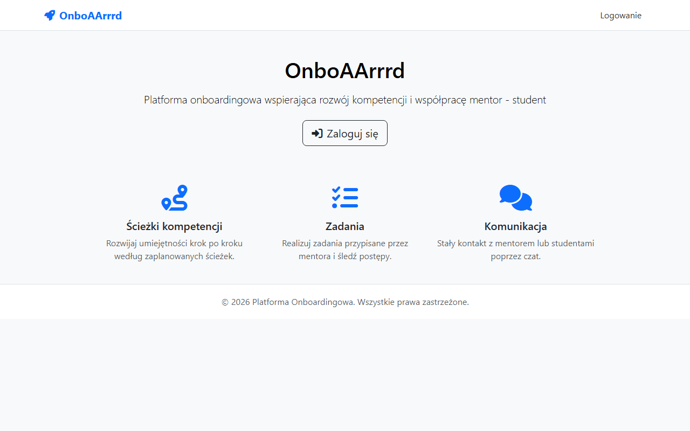 | 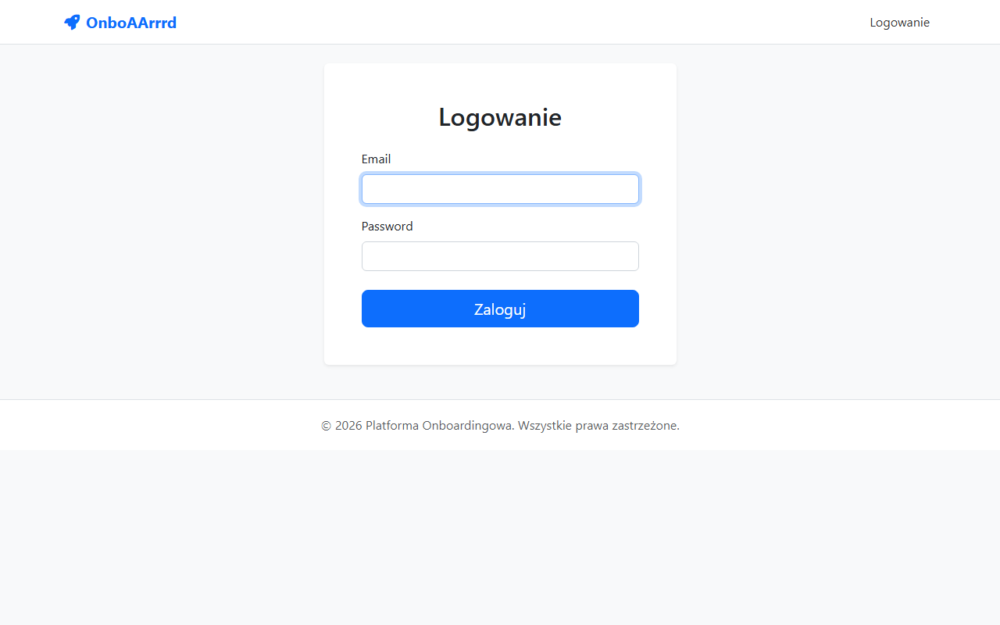 |

### Student

| Dashboard | Tasks | Competency paths |
|:---:|:---:|:---:|
| 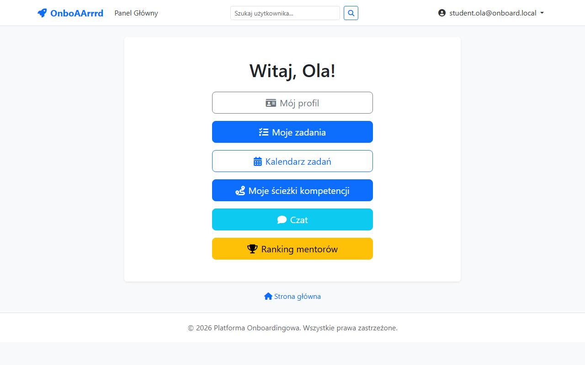 | 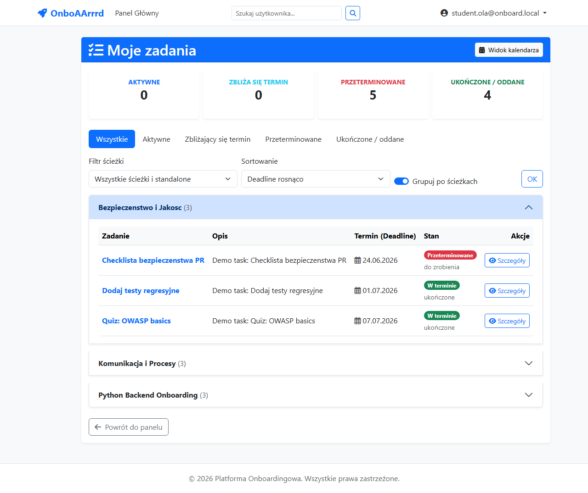 | 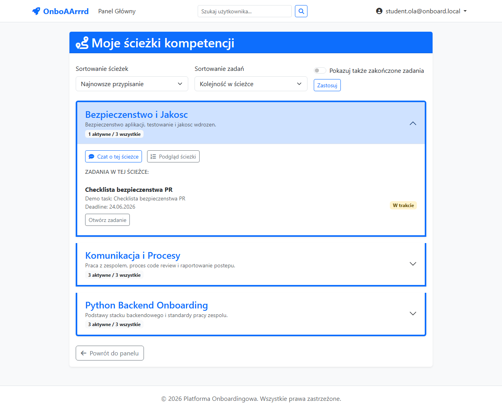 |

| Calendar | Profile | Chat |
|:---:|:---:|:---:|
| 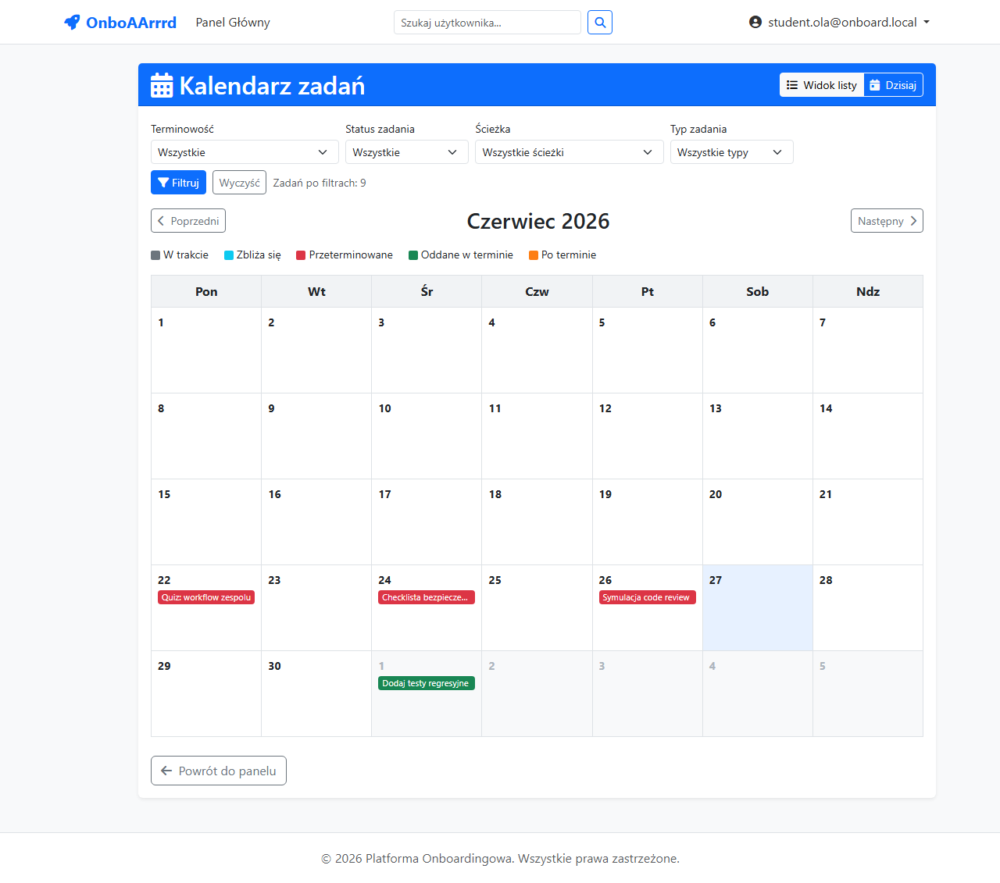 | 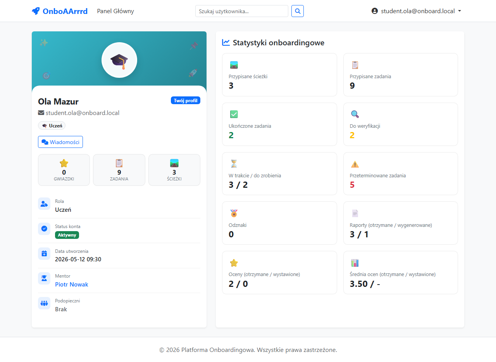 | 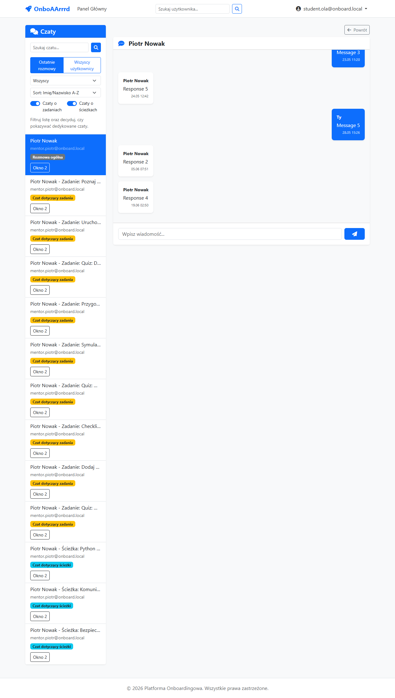 |

### Mentor

| Dashboard | Task management | Chat |
|:---:|:---:|:---:|
| 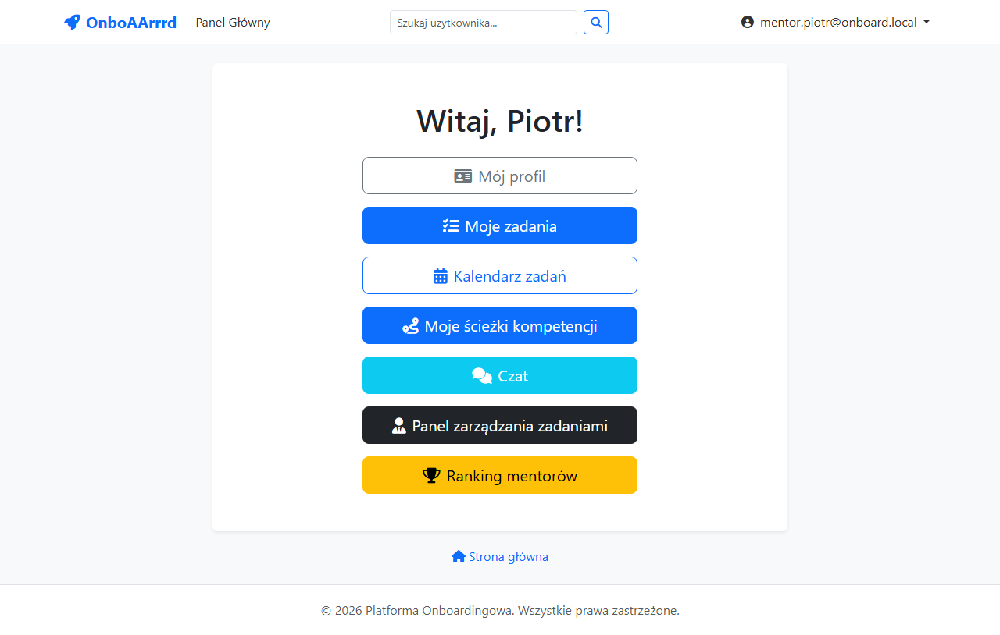 | 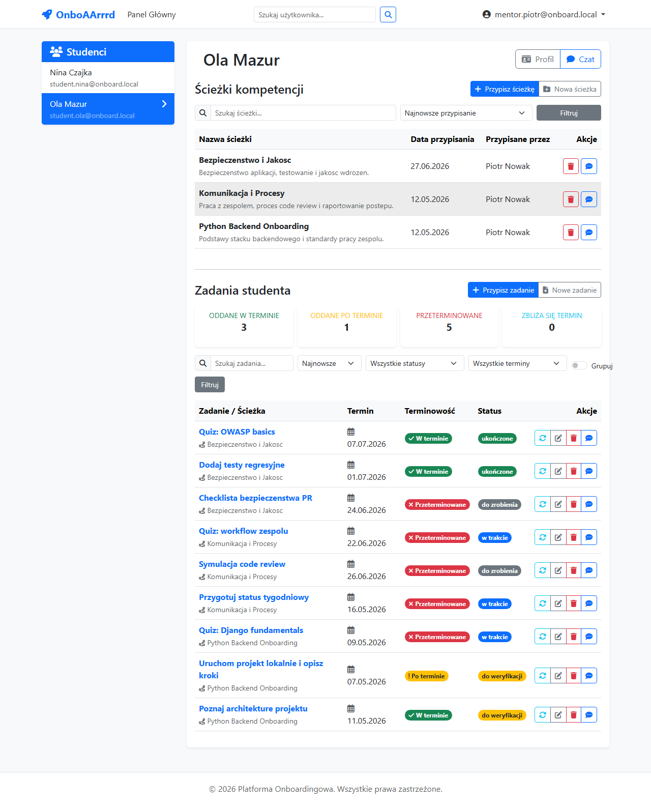 | 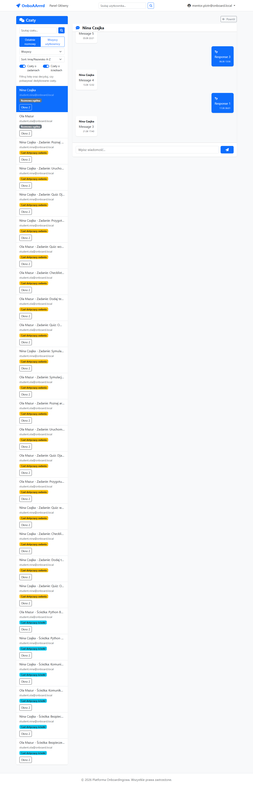 |

### HR

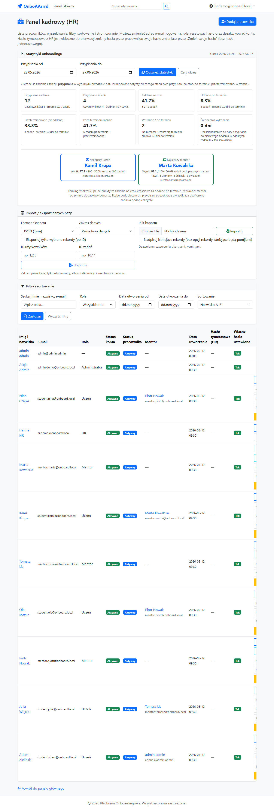

### Other

| Mentor ranking |
|:---:|
| 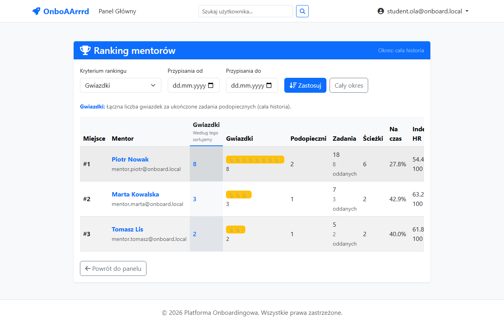 |

Demo accounts are printed by `seed_demo` (see [Database Seeding Guide](#database-seeding-guide)).

## Database schema


Regenerate with `python manage.py db_diagram` (see [docs/database/README.md](docs/database/README.md)).

--- 

## 🐘 Troubleshooting: Migrations Not Applying

If your migrations fail to apply or you encounter inconsistent migration history, you may need to reset the PostgreSQL database completely.
To do this, remove the entire Postgres Docker volume (⚠️ this will delete all database data 🙂):
```bash
docker compose down -v
docker compose up -d
```
After bringing the containers back up, re-run your migrations:
```bash
docker compose exec web python manage.py migrate
```
---
## Setup
### 1. Clone the repository
```bash
git clone https://devtools.wi.pb.edu.pl/bitbucket/scm/th2025gr1/onboaarrrd.git
cd OnboAArrrd
```
### 1.5. Gitconfig
If you want to automatically push to both **Bitbucket** and **GitHub**,  
you need to update your local `.git/config` file.

#### 1. Add GitHub as an additional push target
You can either edit `.git/config` manually or use the command line.

Option A – Command line
```bash
git remote set-url --add --push origin https://devtools.wi.pb.edu.pl/bitbucket/scm/th2025gr1/onboaarrrd.git
git remote set-url --add --push origin https://github.com/uxabix/Django-OnboAArrrd.git
```

Option B – Manual edit
Open `.git/config` and make sure the `[remote "origin"]` section looks like this:
```ini
[remote "origin"]
    url = https://bitbucket.org/your-university/onboaarrd.git
    fetch = +refs/heads/*:refs/remotes/origin/*
    pushurl = https://devtools.wi.pb.edu.pl/bitbucket/scm/th2025gr1/onboaarrrd.git
    pushurl = https://github.com/uxabix/Django-OnboAArrrd.git
```

#### 2. Verify
Run:
```bash
git remote show origin
```
You should see **two Push URLs** — one for Bitbucket and one for GitHub.

Now, every time you push:
```bash
git push --all
```
Git will automatically send all branches and commits to **both repositories** 🎯


### 2. Configure environment variables
Copy .env.example to .env:
```bash
cp .env.example .env
```
### 3. Start the project
Run containers:
```bash
docker compose up --build
```
Available services:
- Django + Channels: http://localhost:8000
- Admin panel: http://localhost:8000/admin
- PostgreSQL: http://localhost:5050/

### 4. Apply migrations and create a superuser
Run migrations:
```bash
docker compose exec web python manage.py makemigrations
docker compose exec web python manage.py migrate
```
Create a superuser:
```bash
docker compose exec web python manage.py createsuperuser
```

### 5. Generate static files
```bash
docker compose exec web python manage.py collectstatic
```

### 6. Work with Django
All commands should be executed inside the web container. Examples:
```bash
docker compose exec web python manage.py shell
docker compose exec web python manage.py makemigrations
docker compose exec web pytest
```

### 7. Stop containers
```bash
docker compose down
```

---

## Documentation (Sphinx)

API and module documentation are generated with **[Sphinx](https://www.sphinx-doc.org/)** using **`sphinx.ext.napoleon`** for **Google-style** docstrings. Source lives under `docs/` (`conf.py`, `index.rst`, `reference.rst`). HTML output is written to `docs/_build/` (ignored by Git).

### Install tooling

Sphinx and the Read the Docs theme are listed in `requirements.txt`. After dependencies are installed in your environment (or rebuilt into the `web` image), you do not need extra packages.

### Build HTML locally

From the repository root:

```bash
pip install -r requirements.txt
sphinx-build -b html docs docs/_build
```

Open `docs/_build/index.html` in a browser.

### Build HTML inside Docker

```bash
docker compose exec web sphinx-build -b html docs docs/_build
```

If the image was built before Sphinx was added to `requirements.txt`, rebuild the image or run `pip install -r requirements.txt` inside the container once.

### Configuration notes

- `docs/conf.py` sets `DJANGO_SETTINGS_MODULE` and calls `django.setup()` so **autodoc** can import project code. Placeholder PostgreSQL env vars are set when missing so the settings module loads during a doc build without a real database.
- API modules are pulled in via `docs/reference.rst` (`.. automodule:: ...`).

---

## Comment and docstring style

All **documentation strings** (module, class, function, and important methods) should be written in **English** and follow the **Google Python Style Guide** for docstrings, as interpreted by Napoleon (see [Google style examples](https://google.github.io/styleguide/pyguide.html#38-comments-and-docstrings)).

### Conventions

1. **Module docstring** — First statement in the file: one or two sentences on what the module is for.
2. **Public APIs** — Document views, forms, management commands, consumers, and non-trivial helpers with a clear summary line and, when useful, **`Args`**, **`Returns`**, **`Raises`** sections.
3. **Django models** — Summarize behavior in the class docstring. Prefer **`help_text`** on fields for UI-oriented detail. Avoid listing every model field again under an **`Attributes:`** block **and** expecting autodoc to list the same fields: that duplicates entries in Sphinx. Use **`Attributes:`** only for non-ORM descriptors that are not already emitted as model fields.
4. **Privacy** — Leading underscore for internal helpers; add a short docstring when the logic is not obvious from the name alone.
5. **User-facing UI copy** — Template strings and messages may stay in the product language (e.g. Polish); **code comments and docstrings** stay in **English** for consistency and tooling.

When you add or change public Python APIs, update docstrings in the same change so `sphinx-build` stays accurate.

---

## Automated tests (pytest)

Tests use **[pytest](https://docs.pytest.org/)** with **[pytest-django](https://pytest-django.readthedocs.io/)**. Configuration lives in `pytest.ini` at the repository root (`DJANGO_SETTINGS_MODULE`, discovery paths under `*/tests/`).

### Running the suite

Pytest loads **`OnboAArrrd.settings`**, which targets **PostgreSQL** (same as the app). Migrations include PostgreSQL-specific SQL, so the suite is oriented toward running **after** `migrate` against a real server (for example the `web` container).

Inside Docker (recommended):

```bash
docker compose exec web pytest
```

Verbose output:

```bash
docker compose exec web pytest -vv
```

Locally, export the same `POSTGRES_*` and `SECRET_KEY` values as in `.env`, install dependencies, then:

```bash
pip install -r requirements.txt
pytest
```

You can still use Django’s runner if needed:

```bash
docker compose exec web python manage.py test
```

### Coverage reports

**[Coverage.py](https://coverage.readthedocs.io/)** is invoked via the **pytest-cov** plugin. Branch coverage and source roots are defined in `.coveragerc` (application packages under `accounts/`, `chat/`, `onboarding/`, `OnboAArrrd/`, `core/`; migrations and `*/tests/*` are omitted).

Terminal summary with missing lines:

```bash
docker compose exec web pytest --cov --cov-config=.coveragerc --cov-report=term-missing
```

HTML report (opens in a browser as `htmlcov/index.html`):

```bash
docker compose exec web pytest --cov --cov-config=.coveragerc --cov-report=html
```

Generated coverage artifacts (`htmlcov/`, `.coverage`, `coverage.xml`) are ignored by Git.

### Practices for new tests

1. **Placement** — Keep tests beside their app in `<app>/tests/test_*.py` (already wired in `pytest.ini`).
2. **Database** — Mark tests that hit the ORM or Django DB with `@pytest.mark.django_db`. Prefer fast, focused examples with minimal rows.
3. **Pure logic** — When testing helpers that only need attribute access, use `types.SimpleNamespace` (see `accounts/tests/test_decorators.py`) instead of building full model graphs.
4. **Naming** — Files `test_<area>.py`, functions `test_<behavior>()` so discovery stays predictable.
5. **Documentation** — Use English module docstrings and short function docstrings in **Google style** (same tone as production code).
6. **Assertions** — One logical behavior per test; use `pytest.raises` for expected errors and `parametrize` for compact scenario tables.
7. **Stability** — Avoid coupling to wall-clock dates when possible; when testing deadlines, anchor to ``django.utils.timezone`` instead of bare ``datetime.today()``.
8. **Database-backed tests** — Prefer `@pytest.mark.django_db` only when the behavior truly needs the ORM. Run them against PostgreSQL (Docker stack) because migrations are not SQLite-compatible.

---

# Database Seeding Guide

This project provides modular seeders and a dedicated demo command for realistic onboarding data.
The default demo dataset is intentionally compact (around 10 users) so it is easy to inspect in UI.

---

## 1. General Usage

All seed commands are implemented as Django management commands under `core/management/commands/`.

### Recommended: full demo dataset
Run the dedicated demo command:

```bash
docker compose exec web python manage.py seed_demo
```

Reset previous seed data and seed again:

```bash
docker compose exec web python manage.py seed_demo --reset-first
```

### Modular seeding (advanced)
You can still run modular seeders via:

python manage.py seed <seeder_name> [--count <number>]

- `<seeder_name>`: The name of the seeder module to run (see the list below).  
- `--count <number>`: Optional parameter to control how many records to create. Default is `10`.

To run multiple seeders sequentially:

`python manage.py seed roles users badges paths tasks quiz user_paths user_tasks task_status grades reports messages --count 10`

---

## 2. What Demo Seed Includes

- ~10 deterministic users with roles: Admin, HR, Mentor, Student.
- Real login credentials are printed to the console after seeding.
- Students are linked to mentors; if superusers exist, at least one student is linked to a superuser too.
- Competency paths and tasks are realistic (not random placeholders).
- User tasks include mixed deadline scenarios and status progressions:
  - completed on time
  - completed late
  - overdue (not submitted)
  - in progress
  - to do
- Mentor stars are generated based on completed tasks.
- Grades, reports, badges, quiz data, and chat messages are generated in moderate volume for demo purposes.

---

## 3. Examples

Run full demo data setup:
```bash
docker compose exec web python manage.py seed_demo
```

Run cleanup + full demo setup:
```bash
docker compose exec web python manage.py seed_demo --reset-first
```

Run selected modular seeders:
```bash
docker compose exec web python manage.py seed roles users paths tasks user_paths user_tasks task_status --count 10
```
---
### Clearing Test Data

You can remove seeded data with `clear_test_data`.
The command is designed to clean both current demo seed data and legacy seed records created by older seeders.

Run the command:
```bash
docker compose exec web python manage.py clear_test_data
```

Cleanup with preserved seed users:
```bash
docker compose exec web python manage.py clear_test_data --keep-users
```

The cleanup command removes:

- Seed users from `TestUsers` and legacy seed emails (`@test.com`, `@onboard.local`)  
- Related chat and onboarding data (`Messages`, `User_tasks`, `Task_status`, `User_paths`, `Reports`, `User_grade`, `User_badges`)  
- Legacy and demo-generated paths/tasks/badges (including old placeholder records like `Competency Path *`, `Task *`, `Badge *`)

Notes:
- Superusers are not deleted by cleanup.
- The command uses a DB transaction for safe cleanup.

---

## 4. Notes

- Seeders are **modular**: you can run each one independently in any order, but some depend on others. For example:  
  - `users` depends on `roles`.  
  - `tasks` depends on `competency_paths` and `task_types`.  
  - `quizzes` depend on `tasks`.  
  - `user_tasks` depends on `users` and `tasks`.  
- Demo seeding is deterministic and focused on product-like scenarios.
- For day-to-day work, prefer `seed_demo` over random/large datasets.

---

## 5. Summary

Use `seed_demo` for a fast, realistic environment that showcases key flows (profiles, mentorship, tasks, deadlines, stars, chat). Use modular `seed` only when you need custom partial data.

---

## 🚀 Stack
- Django, Channels  
- PostgreSQL  
- Docker  
- GitFlow  
- Sphinx  
- pytest, pytest-django, pytest-cov  

---

## 📌 Status
Early development stage.  
See [ROADMAP.md](./ROADMAP.md) for the roadmap.  

---

## ⚖️ License
No license yet. **All rights reserved by the authors.**
